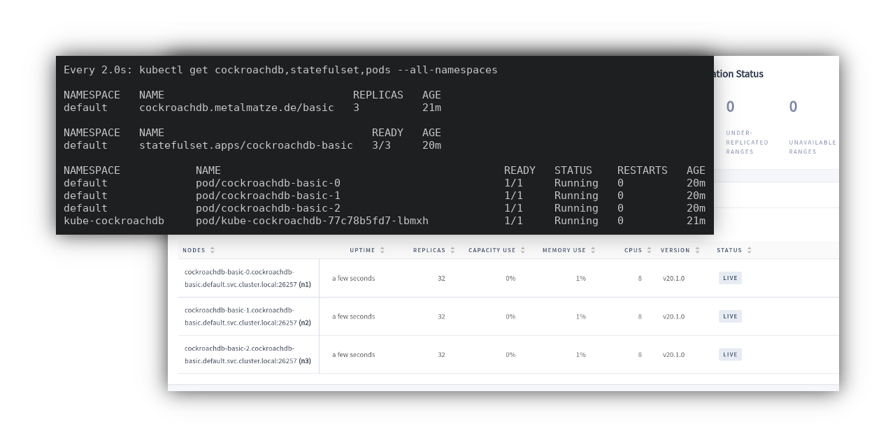

# Kube-CockroachDB
[](https://cloud.drone.io/metalmatze/kube-cockroachdb)[](https://goreportcard.com/report/github.com/metalmatze/kube-cockroachdb)

Deploy [CockroachDB](https://www.cockroachlabs.com/product/) on [Kubernetes](https://kubernetes.io/) using [YAML](https://yaml.org/) or an [Operator](https://coreos.com/blog/introducing-operators.html).



<!--ts-->
   * [Kube-CockroachDB](#kube-cockroachdb)
      * [YAML with Jsonnet &amp; CockroachDB Operator](#yaml-with-jsonnet--cockroachdb-operator)
         * [Jsonnet Example](#jsonnet-example)
         * [Operator Example](#operator-example)
      * [Monitoring](#monitoring)
         * [Prometheus Alerting and Recording Rules &amp; Grafana Dashboards](#prometheus-alerting-and-recording-rules--grafana-dashboards)
      * [Backups](#backups)
      * [Operator](#operator)
         * [Installation](#installation)
         * [Operator-only features](#operator-only-features)
            * [Autoscaling](#autoscaling)
            * [Autoscaling using the Horizontal Pod Autoscaler](#autoscaling-using-the-horizontal-pod-autoscaler)

<!-- Added by: metalmatze, at: Fri 29 May 2020 10:14:26 PM CEST -->

<!--te-->

## YAML with Jsonnet & CockroachDB Operator

The main focus of this project is to generate all necessary Kubernetes files, like StatefulSets, Services, CronJobs, and more with [Jsonnet](https://jsonnet.org).
The idea is to build an abstraction layer on top of the Kubernetes objects, which allows to specify high-level configuration for a CockroachDB instance.

While using these Jsonnet files alone is fine, we can use them as foundation to build an Operator on top of it. The [Locutus](https://github.com/brancz/locutus) project, which used by the Operator as a library, makes use of Jsonnet to template all Kubernetes objects every time as Custom Resource Definition (CRD), in our case a CockroachDB, changes. Before and after these objects are generated we can hook into the [actions](https://github.com/metalmatze/kube-cockroachdb/tree/main/operator/actions) the Operator performs and run more specific things like [initializing](https://github.com/metalmatze/kube-cockroachdb/blob/main/operator/actions/initialize.go), [decommissioning](https://github.com/metalmatze/kube-cockroachdb/blob/main/operator/actions/decommission.go) and [recommissioning](https://github.com/metalmatze/kube-cockroachdb/blob/main/operator/actions/recommission.go) of nodes.
That way we can make use of Jsonnet for templating and use Go for really specific actions we need to perform on the CockroachDB cluster.

### Jsonnet Example

Generating a YAML file containing all necessary Kubernetes objects with:

[embedmd]:#(examples/basic/basic.jsonnet)
```jsonnet
local kubernetes = import '../../kubernetes.libsonnet';

local objects = kubernetes({
  name: 'example',
  replicas: 3,
});

// Let's generate a List containing all Kubernetes objects
{
  apiVersion: 'v1',
  kind: 'List',
  items:
    [objects[name] for name in std.objectFields(objects)],
}
```

*You can play around by changing this file `examples/basic/basic.jsonnet` and then running `make examples/basic/basic.yaml`.*

### Operator Example

Similarly to the Jsonnet example above, where the object is passed into the `kubernetes()` function, we can specify a spec object in our
CockroachDB Custom Resource Definition (CRD) to change the replicas or image.

*In the background the Operator actually generates the same Jsonnet object and then passes it to the same function, as seen in the Jsonnet Example above: [operator/main.jsonnet](https://github.com/metalmatze/kube-cockroachdb/blob/aeb623c601ed78f1e48421b77c68f73c51180d0c/operator/main.jsonnet#L20-L31)*

[embedmd]:#(operator/examples/basic.yaml)
```yaml
apiVersion: metalmatze.de/v1alpha1
kind: CockroachDB
metadata:
  name: basic
  namespace: default
  labels:
    app.kubernetes.io/component: database
    app.kubernetes.io/instance: basic
spec:
  replicas: 3
  image: cockroachdb/cockroach:v20.1.5
```

## Monitoring

By default a *Service Monitor* Custom Resource for the [Prometheus Operator](https://github.com/coreos/prometheus-operator) is generated. This gives an out-of-the-box monitoring experience when running a Prometheus Operator on the same cluster.
This project tries its best to be compatible with the [kube-prometheus](https://github.com/coreos/kube-prometheus/) project. Once you have setup monitoring with kube-prometheus its Prometheus is going to automatically start scraping the deployed CockroachDB instances.

### Prometheus Alerting and Recording Rules & Grafana Dashboards

*I've created an Issue to discuss the addition of Prometheus recording & alerting rules and Grafana dashboards: [#2](https://github.com/metalmatze/kube-cockroachdb/issues/2).*

## Backups

We want backups to be as easy as possible, so that as many users as possible make use of them.
For a start we want to add a Kubernetes CronJob that is configured to create a SQL dump and then save it to an S3 compatible object storage.

*This feature isn't part of the YAML or Operator yet, but I've created an [issue to discuss its addition](https://github.com/metalmatze/kube-cockroachdb/issues/1)*.

## Operator

### Installation

The Operator comes as a pre-build container images: [quay.io/metalmatze/kube-cockroachdb](https://quay.io/metalmatze/kube-cockroachdb).

The `operator/deployment/` contains a file that you can use to the deploy an instance of the Operator to deploy it to the `cockroachdb` namespace in your cluster. It'll start watching all `CockroachDB` Custom Resource Definitions (CRDs) in all namespaces by default.

```bash
# Operator currently depends on the ServiceMonitor CRD
kubectl apply -f https://raw.githubusercontent.com/coreos/kube-prometheus/main/manifests/setup/prometheus-operator-0servicemonitorCustomResourceDefinition.yaml
# CockroachDB Custom Resource Definition
kubectl apply -f https://raw.githubusercontent.com/metalmatze/kube-cockroachdb/main/operator/metalmatze.de_cockroachdbs.yaml
# We'll deploy the operator to this namespace
kubectl create namespace kube-cockroachdb
# Deploy the actual operator
kubectl apply -f https://raw.githubusercontent.com/metalmatze/kube-cockroachdb/main/operator/deployment.yaml
# Optionally deploy a example instance
kubectl apply -f https://raw.githubusercontent.com/metalmatze/kube-cockroachdb/main/operator/examples/basic.yaml
```

*If you want an Operator deployment that's only able to read and write it's own namespace, please open an issue. I'm happy to add this upon request.*

### Operator-only features

#### Autoscaling

The CockroachDB Operator is able to automatically scale the CockroachDB clusters by supporting decommissioning and recommissioning of nodes.

The easiest way to try this, is by running a cluster with the CockroachDB Operator and then running the *kubectl scale* command:

```bash
kubectl scale cockroachdbs basic --replicas 5 # scaling up from 3
kubectl scale cockroachdbs basic --replicas 3 # scaling down from 5 (decommission of pod 3 and 4)
kubectl scale cockroachdbs basic --replicas 5 # scaling up from 3 (recommission of pod 3 and 4, due earlier decommission)
```

It means, that nodes that will be removed from the cluster due to scaling down, are going to "transfer all range replicas on the node to other nodes". Please read the official [Decommission Nodes](https://www.cockroachlabs.com/docs/stable/remove-nodes.html) documentation to learn more. The Operator is implemented to run `cockroach node decommission 3 4` against `pod-0` in the cluster: [operator/actions/decommission.go](https://github.com/metalmatze/kube-cockroachdb/blob/main/operator/actions/decommission.go). Only if the decommission command succeeds the StatefulSet is actually scaled down removing the Pods going forward.

Similarly, once nodes have been decommissioned they need to be recommissioned to be used again, essentially telling the CockroachDB cluster to send range replicas to those nodes again. The Operator is implemented to run `cockroach node recommission 3 4` after scaling up a StatefulSet.

#### Autoscaling using the Horizontal Pod Autoscaler

It's possible and I've used the `cockroachdb_sql_selects_total` query to scale up and down based on the number of incoming select requests. Let me know if you're interested, then I'll write about it in depth. *Need to write the rest of the README first :slightly_smiling_face:*
